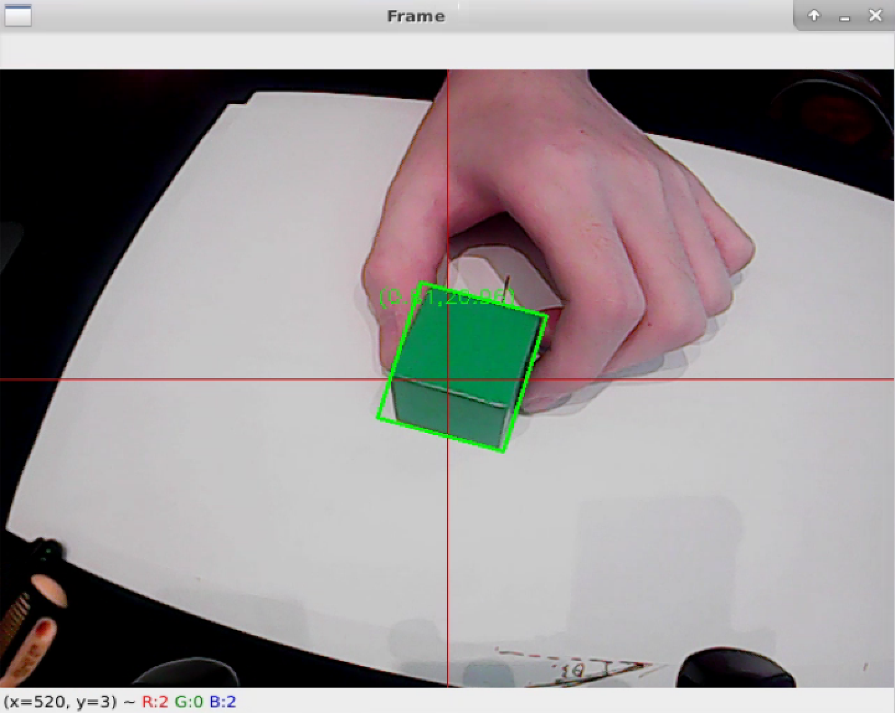

# RoboticArm-ColorTracking
This project implements real-time color-based object tracking using computer vision and PID-controlled servo motors. Running on a Raspberry Pi, it detects an object of a specific color and aligns a robotic arm toward it using a feedback loop. The system combines OpenCV image processing, coordinate transformation, and servo control via a modular hardware interface—ideal for robotics and automation experiments.
# Features & How It Works
1. **Color Detection:**<br>
Captures live video and processes it using OpenCV. Converts frames to LAB color space for robust color segmentation. A bounding box and center point are calculated for the largest detected colored object.<br>
2. **Center Alignment via PID:**<br>
A PID controller computes the error between the object's position and the image center. This feedback adjusts the servo angles smoothly to center the object.<br>
3. **Servo Control Integration:**<br>
Using the Board.py hardware abstraction layer, the system communicates with servo motors over I2C. Both horizontal and vertical servo movements are controlled in real time.<br>
4. **Coordinate Mapping:**<br>
Pixel positions are translated into real-world coordinates, making the system suitable for applications like robotic grasping or sorting.<br>
5. **Modular and Extendable:**<br>
Components are separated by responsibility—PID logic (PID.py), image tracking (colorTracking.py), and hardware control (Board.py). This makes it easy to expand or modify the system.
# Running the Code
```bash
python3 colorTracking.py
```
# Configuration
```python3
detect_color = 'green'  # Options: 'red', 'green', 'blue', etc.

# PID tuning
x_pid = PID.PID(P=0.1, I=0.00, D=0.008)
```
# Key Modules
**PID.py**<br>
Implements a basic PID controller to calculate precise control signals based on the current and desired position of the object.<br>

**colorTracking.py**<br>
Main logic for:<br>
·Reading video input<br>
·Applying image transformations<br>
·Detecting and tracking colored objects<br>
·Controlling servos via the Board module<br>
**Board.py**<br>
Abstracts low-level communication with the HiWonder bus servo motors using I2C. Also provides LED and motor functions.<br>
# Screenshot of Object Detection & Contour Highlight in Real-Time

